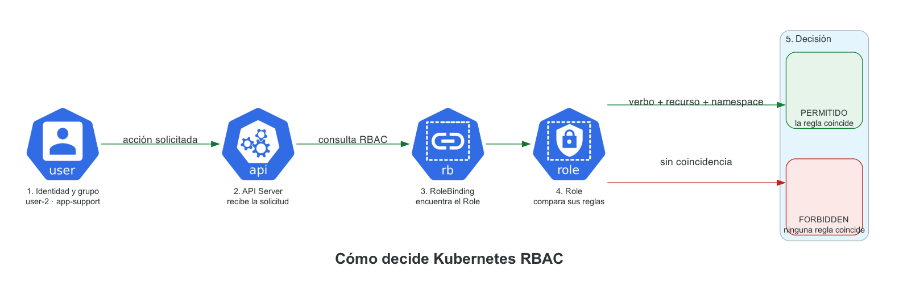

# Laboratorio: IAM con Kubernetes RBAC

Este laboratorio reproduce en Kubernetes un esquema de permisos por función: soporte de almacenamiento, soporte de aplicaciones y administración de aplicaciones. Los permisos se definen con `Role` y se asignan a grupos mediante `RoleBinding`.

> **Autenticar** es comprobar quién realiza la solicitud. **Autorizar** es decidir si esa identidad puede realizar la acción solicitada.

## El escenario

La aplicación `portal` tiene tres perfiles de acceso:

| Identidad | Grupo | Responsabilidad | Permisos |
|---|---|---|---|
| `user-1` | `storage-support` | Soporte de almacenamiento | Consultar PVC |
| `user-2` | `app-support` | Soporte de aplicaciones | Consultar Pods y Deployments |
| `user-3` | `app-admin` | Administración de aplicaciones | Consultar y escalar Deployments |

Equivalencias con AWS IAM:

| AWS IAM | Kubernetes RBAC |
|---|---|
| Usuario autenticado | Identidad autenticada por el API Server |
| User group | Grupo de la identidad |
| Policy | `Role` |
| Policy asignada a un grupo | `RoleBinding` |
| Action | Verbo como `get`, `list` o `patch` |
| Resource | Pod, Deployment o PVC |
| Access denied | `Forbidden` |



El API Server recibe la identidad, los grupos y la operación solicitada. RBAC busca los `RoleBinding` aplicables y comprueba las reglas de sus Roles.

## Requisitos

- Docker Desktop con Kubernetes activado;
- `kubectl` instalado;
- el contexto administrativo `docker-desktop`.

Comprobar el entorno:

```bash
kubectl --context docker-desktop get nodes
```

El nodo de Docker Desktop debe aparecer con estado `Ready`.

---

## Parte 1 — Crear el escenario

> Este comando instala el laboratorio. Los comandos posteriores no crean los recursos.

Desde la raíz del repositorio:

```bash
kubectl --context docker-desktop apply -f manifests/
```

La salida debe incluir un namespace, un Deployment, un PVC, tres Roles y tres RoleBindings. Verificar la instalación:

```bash
kubectl --context docker-desktop get deployment,pods,pvc,roles,rolebindings -n tienda
```

Recursos esperados:

```text
Deployment       portal
PVC              datos-portal
Roles            storage-reader, app-reader, app-operator
RoleBindings     storage-support-can-read-storage
                 app-support-can-read-apps
                 app-admin-can-operate-apps
```

Si aparece `No resources found`, aplicar nuevamente los manifiestos:

```bash
kubectl --context docker-desktop apply -f manifests/
```

Si no existe la ruta `manifests/`, comprobar el directorio actual:

```bash
pwd
ls manifests
```

Estructura de los manifiestos:

```text
manifests/
├── 00-scenario.yaml       namespace, aplicación y almacenamiento
├── 10-roles.yaml          permisos de cada función
└── 20-rolebindings.yaml   grupos que reciben cada Role
```

### Entender `00-scenario.yaml`

El primer documento crea el namespace:

```yaml
apiVersion: v1
kind: Namespace
metadata:
  name: tienda
```

- `apiVersion` indica la versión de la API utilizada.
- `kind` indica el tipo de objeto.
- `metadata.name` define el nombre `tienda`.

Los Roles de este laboratorio tienen alcance únicamente dentro de `tienda`.

El segundo documento crea el Deployment:

```yaml
apiVersion: apps/v1
kind: Deployment
metadata:
  name: portal
  namespace: tienda
spec:
  replicas: 1
  selector:
    matchLabels:
      app: portal
  template:
    metadata:
      labels:
        app: portal
    spec:
      containers:
        - name: portal
          image: nginx:1.27-alpine
          volumeMounts:
            - name: datos
              mountPath: /datos
      volumes:
        - name: datos
          persistentVolumeClaim:
            claimName: datos-portal
```

Campos relevantes:

- `namespace: tienda`: el Deployment pertenece a nuestro escenario;
- `replicas: 1`: mantiene un Pod en ejecución;
- `selector` y `labels`: conectan el Deployment con sus Pods;
- `image`: define la imagen ejecutada por el contenedor;
- `volumeMounts` y `volumes`: montan en el Pod el almacenamiento solicitado por el PVC.

El último documento crea una solicitud de almacenamiento:

```yaml
apiVersion: v1
kind: PersistentVolumeClaim
metadata:
  name: datos-portal
  namespace: tienda
spec:
  accessModes:
    - ReadWriteOnce
  resources:
    requests:
      storage: 100Mi
```

El PVC es el recurso administrado por el perfil de soporte de almacenamiento.

---

## Parte 2 — Roles

Un `Role` es un conjunto de permisos válido dentro de un namespace. No identifica personas: solamente describe acciones permitidas.

Los tres Roles están definidos en [manifests/10-roles.yaml](manifests/10-roles.yaml).

### Role `storage-reader`

```yaml
apiVersion: rbac.authorization.k8s.io/v1
kind: Role
metadata:
  name: storage-reader
  namespace: tienda
rules:
  - apiGroups: [""]
    resources: ["persistentvolumeclaims"]
    verbs: ["get", "list", "watch"]
```

Campos de la regla:

| Campo | Pregunta | Valor en este Role |
|---|---|---|
| `metadata.namespace` | ¿Dónde se aplica? | En `tienda` |
| `apiGroups` | ¿En qué grupo de la API? | `""`, el grupo principal o core |
| `resources` | ¿Sobre qué objetos? | PVC |
| `verbs` | ¿Qué acciones permite? | Consultar y observar |

El valor vacío de `apiGroups` no significa “todos”. Significa el grupo principal de Kubernetes, donde se encuentran Pods, Services, ConfigMaps y PVC.

Este Role no incluye `create`, `update`, `patch` ni `delete`. Por lo tanto, no permite modificar el almacenamiento.

### Role `app-reader`

```yaml
rules:
  - apiGroups: [""]
    resources: ["pods"]
    verbs: ["get", "list", "watch"]
  - apiGroups: ["apps"]
    resources: ["deployments"]
    verbs: ["get", "list", "watch"]
```

El Role contiene dos reglas porque los recursos pertenecen a grupos de API diferentes:

- los Pods están en el grupo principal `""`;
- los Deployments están en el grupo `apps`.

Los tres verbos son de lectura:

- `get`: obtener un objeto conocido;
- `list`: enumerar objetos;
- `watch`: observar sus cambios.

`user-2` puede ver un Deployment, pero no escalarlo porque no tiene `patch` ni `update`.

### Role `app-operator`

```yaml
rules:
  - apiGroups: [""]
    resources: ["pods"]
    verbs: ["get", "list", "watch"]
  - apiGroups: ["apps"]
    resources: ["deployments"]
    verbs: ["get", "list", "watch"]
  - apiGroups: ["apps"]
    resources: ["deployments/scale"]
    verbs: ["get", "patch", "update"]
```

Además de lectura, este Role permite:

- `patch`: modificar una parte del Deployment;
- `update`: reemplazar su representación con una versión actualizada.

`deployments/scale` es un **subrecurso**: representa solamente la escala del Deployment. `kubectl scale` lo consulta y envía allí el cambio de réplicas. Separarlo de `deployments` permite autorizar el escalado sin entregar otras modificaciones sobre la definición de la aplicación.

No incluye `create` ni `delete`. El grupo puede cambiar la cantidad de réplicas, pero no crear ni eliminar aplicaciones.

> Kubernetes RBAC es aditivo. Los Roles agregan permisos; normalmente no escribimos reglas `deny`. Si ninguna regla permite una operación, se rechaza.

---

## Parte 3 — RoleBindings

Un `RoleBinding` entrega un Role a usuarios, grupos o ServiceAccounts dentro de un namespace.

Los enlaces entre grupos y Roles están en [manifests/20-rolebindings.yaml](manifests/20-rolebindings.yaml):

```yaml
apiVersion: rbac.authorization.k8s.io/v1
kind: RoleBinding
metadata:
  name: storage-support-can-read-storage
  namespace: tienda
subjects:
  - kind: Group
    name: storage-support
    apiGroup: rbac.authorization.k8s.io
roleRef:
  kind: Role
  name: storage-reader
  apiGroup: rbac.authorization.k8s.io
```

Este objeto asigna el Role `storage-reader` al grupo `storage-support` dentro de `tienda`.

Sus dos secciones principales son:

- `subjects`: quién recibe los permisos;
- `roleRef`: qué Role recibe.

Asignaciones definidas:

```text
storage-support → storage-reader
app-support     → app-reader
app-admin       → app-operator
```

Asignar permisos a grupos evita duplicar reglas para cada usuario.

### ¿Dónde están creados los usuarios y grupos?

Kubernetes reconoce nombres de usuarios y grupos durante la autenticación, pero la API estándar no guarda objetos `User` o `Group` como guarda Pods o Deployments. En un entorno real, esas identidades suelen provenir de OIDC, certificados o algún otro sistema de autenticación integrado con el API Server.

Las pruebas usan la impersonación de `kubectl`:

```bash
--as=user-2 --as-group=app-support
```

El API Server evalúa la solicitud como si proviniera de esa identidad. Esto no crea una cuenta ni inicia una sesión real; requiere ejecutar el comando desde un contexto con permiso para impersonar.

---

## Parte 4 — Pruebas de permisos

### `user-1`: soporte de almacenamiento

Consultar si puede listar PVC:

```bash
kubectl --context docker-desktop auth can-i list persistentvolumeclaims \
  -n tienda \
  --as=user-1 \
  --as-group=storage-support
```

Resultado esperado:

```text
yes
```

Ejecutar la operación:

```bash
kubectl --context docker-desktop get pvc \
  -n tienda \
  --as=user-1 \
  --as-group=storage-support
```

Comprobar que no puede listar Deployments:

```bash
kubectl --context docker-desktop auth can-i list deployments \
  -n tienda \
  --as=user-1 \
  --as-group=storage-support
```

Resultado esperado: `no`.

### `user-2`: soporte de aplicaciones

Listar las aplicaciones:

```bash
kubectl --context docker-desktop get deployments,pods \
  -n tienda \
  --as=user-2 \
  --as-group=app-support
```

Consultar el permiso de escala:

```bash
kubectl --context docker-desktop auth can-i patch deployment/portal \
  --subresource=scale \
  -n tienda \
  --as=user-2 \
  --as-group=app-support
```

Resultado esperado: `no`.

Intentar escalar el Portal:

```bash
kubectl --context docker-desktop scale deployment portal \
  --replicas=0 \
  -n tienda \
  --as=user-2 \
  --as-group=app-support
```

Kubernetes responde con `Forbidden`: la identidad fue reconocida, pero ninguna regla le permite modificar la escala del Deployment.

```text
Unauthorized → no se pudo establecer una identidad válida
Forbidden    → identidad conocida, operación no autorizada
```

### `user-3`: administración de aplicaciones

Comprobar el permiso:

```bash
kubectl --context docker-desktop auth can-i patch deployment/portal \
  --subresource=scale \
  -n tienda \
  --as=user-3 \
  --as-group=app-admin
```

Resultado esperado: `yes`.

Reducir las réplicas a cero:

```bash
kubectl --context docker-desktop scale deployment portal \
  --replicas=0 \
  -n tienda \
  --as=user-3 \
  --as-group=app-admin
```

Verificar el cambio:

```bash
kubectl --context docker-desktop get deployment,pods -n tienda
```

Restaurar una réplica:

```bash
kubectl --context docker-desktop scale deployment portal \
  --replicas=1 \
  -n tienda \
  --as=user-3 \
  --as-group=app-admin
```

El perfil de soporte puede observar la aplicación; el perfil administrador también puede cambiar su escala.

## Limpiar el laboratorio

Eliminar el namespace y todos sus recursos:

```bash
kubectl --context docker-desktop delete namespace tienda
```

Después de eliminar el namespace, las comprobaciones de permisos responderán `no` hasta volver a aplicar los manifiestos.

## Solución de problemas

### No aparece ningún recurso y `can-i` responde `no`

Aplicar los manifiestos y verificar los permisos:

```bash
kubectl --context docker-desktop apply -f manifests/
kubectl --context docker-desktop get roles,rolebindings -n tienda
kubectl --context docker-desktop auth can-i list persistentvolumeclaims \
  -n tienda \
  --as=user-1 \
  --as-group=storage-support
```

El último comando debe responder `yes`.

### El namespace existe pero está vacío

Crear solamente el namespace no instala el resto del escenario:

```bash
kubectl --context docker-desktop apply -f manifests/
```

### El contexto no existe

Listar los contextos disponibles:

```bash
kubectl config get-contexts
```

Docker Desktop debe tener Kubernetes activado y mostrar el contexto `docker-desktop`.

## Referencias

- [Autorización RBAC en Kubernetes](https://kubernetes.io/docs/reference/access-authn-authz/rbac/)
- [Autenticación en Kubernetes](https://kubernetes.io/docs/reference/access-authn-authz/authentication/)
- [Referencia de `kubectl auth can-i`](https://kubernetes.io/docs/reference/kubectl/generated/kubectl_auth/kubectl_auth_can-i/)
